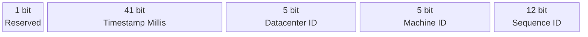

# Unique ID

### Auto increment

- Hard to scale
- Do not go up with time across multiple servers

### UUID

- Non-numeric
- Do not go up with time
- 128-bits long

### Flickr Ticket server

- Centralize auto increment ID in a single database server, called a Ticket Server

### Twitter snowflake

- Each millisecond, single machine can generate up to $4096$ ($2^{12}$) records

### Materials

- Clock synchronization: Network Time Protocol

- Snowflake section length tunning
